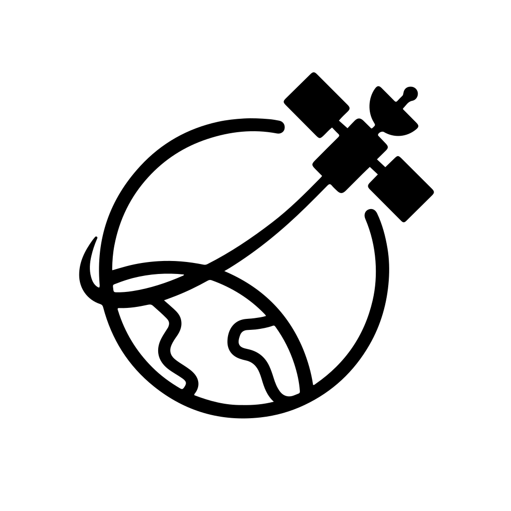

<div align="center">
  
</div>

# Aircast: From Orbit to Earth — Toward Unified Air Quality Sensing

<div align="center">
  
[](LICENSE)
&nbsp;&nbsp;
[](https://vitejs.dev/)
&nbsp;&nbsp;
[](https://www.spaceappschallenge.org/2025/challenges/from-earthdata-to-action-cloud-computing-with-earth-observation-data-for-predicting-cleaner-safer-skies/?tab=resources)

</div>

Aircast is our submission for the **NASA Space Apps Challenge 2025**, addressing the ["From EarthData to Action: Cloud Computing with Earth Observation Data for Predicting Cleaner, Safer Skies"](https://www.spaceappschallenge.org/2025/challenges/from-earthdata-to-action-cloud-computing-with-earth-observation-data-for-predicting-cleaner-safer-skies/) challenge.

This web-based application provides unified visualization of air quality data across **North America** by combining:

* **NASA TEMPO Satellite Observations** - Near-Real-time atmospheric NO₂ measurements from space covering North America
* **Ground-based Monitoring Networks** - Air quality data from OpenAQ and Pandora stations across the United States
* **Machine Learning Predictions** - LSTM model for forecasting Air Quality Index (AQI) at specific monitoring stations

### Key Features
- Display and integrate data from diverse sources
- Near real-time TEMPO data (NO2)
- Ground-based air quality measurements (e.g., Pandora, OpenAQ)
- Compare satellite data with ground station data for validation purposes in real time
- Generate forecasts of local air quality (Certain fixed station)
- Visualize complex information clearly to users

The platform transforms complex Earth observation data into actionable insights, supporting public health monitoring, environmental research, and policy-making decisions for cleaner, safer skies.


## Project Architecture

```
┌─────────────────────────────────────────────────────────────────────────────┐
│                                    User                                     │
└─────────────────────────────────────┬───────────────────────────────────────┘
                                      │
                                      ▼
┌─────────────────────────────────────────────────────────────────────────────┐
│                              React Frontend                                 │
│       ┌─────────────────┐  ┌─────────────────┐  ┌─────────────────┐         │
│       │    MapView      │  │   InfoPanel     │  │     App.jsx     │         │
│       └─────────────────┘  └─────────────────┘  └─────────────────┘         │
└─────────────────────────────────────┼───────────────────────────────────────┘
                                      │
                                      ▼
┌─────────────────────────────────────────────────────────────────────────────┐
│                        Cloudflare Worker (CORS proxy)                       │
└─────────────────┬───────────────────┬─────────────────────┬─────────────────┘
                  │                   │                     │
                  ▼                   ▼                     ▼
     ┌───────────────────┐ ┌────────────────────┐ ┌───────────────────┐
     │     ML Server     │ │     OpenAQ API     │ │    Pandora API    │
     │     (FastAPI)     │ │                    │ │                   │
     └───────────────────┘ └────────────────────┘ └───────────────────┘

┌──────────────────────────────────────────────────────────────────────────────┐
│                            GitHub Repository                                 │
│  ┌────────────────────────────────────────────────────────────────────────┐  │
│  │                           GitHub Actions                               │  │
│  └────────────────────────────────────────────────────────────────────────┘  │
│                                     │                                        │
│                                     ▼                                        │
│  ┌────────────────────────────────────────────────────────────────────────┐  │
│  │                            Static Assets                               │  │
│  └────────────────────────────────────────────────────────────────────────┘  │
└──────────────────────────────────────────────────────────────────────────────┘

┌──────────────────────────────────────────────────────────────────────────────┐
│                            NASA TEMPO Satellite                              │
└──────────────────────────────────────────────────────────────────────────────┘
```

## Deployment

### Website 
[](https://68332.github.io/Aircast/)

```bash
# Install dependencies
npm install

# Build the project
npm run dev
➜  Local:   http://localhost:5173/
```

### Fetch TEMPO Data

```bash
cd scripts

# Install Python dependencies
python -m venv venv
source venv/bin/activate
pip install -r requirements.txt

# Set up NASA Earthdata credentials (create .env file in project root)
# EARTHDATA_USERNAME=your_username
# EARTHDATA_PASSWORD=your_password

# Fetch latest TEMPO_NO2_L3_NRT_V02.nc data then transform to raster tiles format to display on the map
python fetch_tempo_no2.py
# Raster tiles images will be stored under /public/tempo/tiles
```
### Model
* Model Repository - https://github.com/68332/tempo-aqi-model

## Data Sources
* NASA Pandora - https://pandora.gsfc.nasa.gov
* NASA TEMPO data - https://asdc.larc.nasa.gov/project/TEMPO
* TEMPO_NO2_L3_NRT_V02 collection dataset - https://asdc.larc.nasa.gov/project/TEMPO/TEMPO_NO2_L3_NRT_V02
* openaq - https://openaq.medium.com/where-does-openaq-data-come-from-a5cf9f3a5c85
* US border geo json file - https://eric.clst.org/assets/wiki/uploads/Stuff/gz_2010_us_040_00_500k.json

## References
* NASA Space Apps Challenge Resource - https://www.spaceappschallenge.org/2025/challenges/from-earthdata-to-action-cloud-computing-with-earth-observation-data-for-predicting-cleaner-safer-skies/?tab=resources
* AQI Documentent - [Technical Assistance Document for the Reporting of Daily Air Quality – the Air Quality Index (AQI) (U.S. Environmental Protection Agency )](https://document.airnow.gov/technical-assistance-document-for-the-reporting-of-daily-air-quailty.pdf)
* AQI Wikipedia - https://en.wikipedia.org/wiki/Air_quality_index
* Comprehensive Analysis of Bias in TEMPO NO2 Column Densities Through Pandora Observations - https://agupubs.onlinelibrary.wiley.com/doi/full/10.1029/2025JD044150
* AOD-Hybrid-Paper - https://github.com/p3jitnath/AOD-Hybrid-Paper
* AQI LSTM model - https://github.com/vishnukanduri/Air-quality-index-prediction-using-LSTM
* NASA CMR Search api doc - https://cmr.earthdata.nasa.gov/search/site/docs/search/api.html
* openaq api doc - https://api.openaq.org
* Maplibre - [MapLibre](https://maplibre.org) is an open-source WebGL map rendering library that lets you display and style interactive maps using vector tiles.
* react-maplibre - [react-maplibre](https://visgl.github.io/react-maplibre/docs/get-started) is a React wrapper around MapLibre, providing declarative components to build interactive maps easily in React applications.
* OpenFreeMap - [OpenFreeMap](https://openfreemap.org) is a free and open platform that provides vector tiles and map styles based on OpenStreetMap, offering an open alternative to commercial map APIs. (Provide vector tiles server with no usage limit. )
* MUI - Material UI - https://mui.com

## License

This project is licensed under the MIT License - see the [LICENSE](LICENSE) file for details.